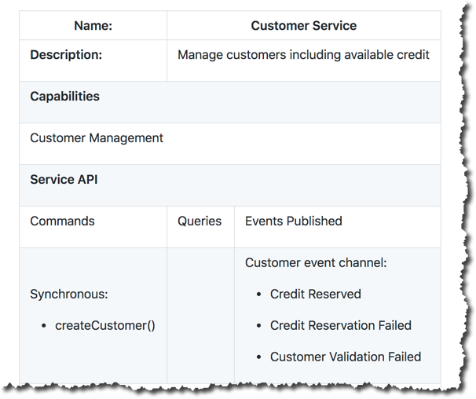
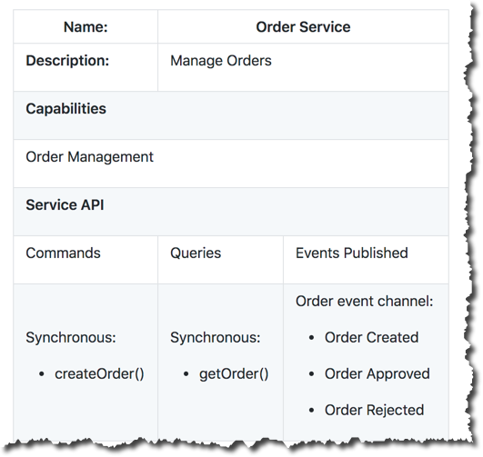
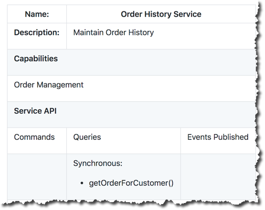

= Um projeto Eventuate

image::https://eventuate.io/i/logo.gif[]

Este projeto faz parte do http://eventuate.io[Eventuate], que é uma plataforma de colaboração para microservices.

## Eventuate Tram Customers and Orders

Esta aplicação demonstra dois padrões-chave:

* http://microservices.io/patterns/data/saga.html[Sagas] - implementa transações que abrangem múltiplos services
* http://microservices.io/patterns/data/cqrs.html[CQRS] - implementa queries que recuperam dados de múltiplos services.

A aplicação consiste em três services:

* `Order Service` - gerencia pedidos
* `Customer Service` - gerencia clientes
* `Order History Service` - mantém o histórico de pedidos

Todos os services são implementados usando Spring Boot, JPA e o https://github.com/eventuate-tram/eventuate-tram-core[framework Eventuate Tram], que fornece publish/subscribe transacional.

O `Order Service` usa uma Saga baseada em coreografia para garantir o limite de crédito do cliente ao criar pedidos.

O `Order History Service` implementa uma view CQRS e se inscreve (subscribes) nos eventos de domínio (domain events) publicados pelo `Order Service` e pelo `Customer Service`.

Role para baixo para fazer um tour pelo código dentro de um Github Codespace ou do Visual Studio Code.

== Sobre Sagas

http://microservices.io/patterns/data/saga.html[Sagas] são um mecanismo para manter a consistência de dados em uma http://microservices.io/patterns/microservices.html[arquitetura de microservices].
Uma Saga é uma sequência de transações, cada uma delas local a um service.

Existem duas maneiras principais de coordenar Sagas: orquestração e coreografia.
Este exemplo usa Sagas baseadas em coreografia, que utilizam eventos de domínio para coordenação.
Cada passo de uma Saga atualiza o banco de dados local e publica um evento de domínio.
O evento de domínio é processado por um event handler, que executa a próxima transação local.

Para saber mais sobre por que você precisa de Sagas se estiver usando microservices:

* Veja o https://github.com/eventuate-tram/eventuate-tram-sagas-examples-customers-and-orders[exemplo de Saga baseada em orquestração]
* Leia o http://microservices.io/patterns/data/saga.html[padrão Saga]
* Assista à https://microservices.io/microservices/general/2019/04/28/asynchronous-microservices.html[apresentação na MicroCPH 2019]
* Leia sobre Sagas no meu https://microservices.io/book[livro de padrões de microservices]

=== A Saga Create Order

A Saga para criar um `Order` consiste nos seguintes passos:

1. O Order Service cria um `Order` no estado `PENDING` e publica um evento `OrderCreated`
2. O `Customer Service` recebe o evento e tenta reservar crédito para aquele `Order`. Ele publica um evento `CreditReserved` ou um evento `CreditLimitExceeded`.
3. O `Order Service` recebe o evento e altera o estado do pedido para `APPROVED` ou `REJECTED`.

== Sobre Command Query Responsibility Segregation (CQRS)

O http://microservices.io/patterns/data/cqrs.html[padrão CQRS] implementa queries que recuperam dados de múltiplos services.
Ele mantém uma réplica consultável (queryable replica) dos dados, inscrevendo-se (subscribing) nos eventos de domínio publicados pelos services que são donos dos dados.

Neste exemplo, o `Order History Service` mantém uma view CQRS no MongoDB, inscrevendo-se nos eventos de domínio publicados pelo `Order Service` e pelo `Customer Service`.
A view CQRS armazena cada cliente como um documento MongoDB que contém informações sobre o cliente e seus pedidos.

Para saber mais sobre por que você precisa de CQRS se estiver usando microservices:

* Leia o http://microservices.io/patterns/data/cqrs.html[padrão CQRS]
* Assista à https://microservices.io/microservices/general/2019/04/28/asynchronous-microservices.html[apresentação na GOTO Chicago 2019]
* Leia sobre CQRS no meu https://microservices.io/book[livro de padrões de microservices]

== Mensageria transacional com Eventuate Tram

Os services usam o https://github.com/eventuate-tram/eventuate-tram-core[framework Eventuate Tram] para se comunicarem de forma assíncrona usando eventos.
O fluxo para publicar um evento de domínio usando o Eventuate Tram é o seguinte:

1. O Eventuate Tram insere eventos na tabela `MESSAGE` como parte da transação ACID que atualiza a entidade JPA.
2. O serviço CDC do Eventuate Tram rastreia inserções na tabela `MESSAGE` usando o binlog do MySQL (ou WAL do Postgres) e publica as mensagens no Apache Kafka.
3. Um service se inscreve (subscribes) nos eventos, atualiza seu banco de dados e, possivelmente, publica mais eventos.

== Arquitetura

O diagrama a seguir mostra a arquitetura da aplicação Customers and Orders.

// image::.Eventuate_Tram_Customer_and_Order_Architecture.png[]

A aplicação consiste em três services: `Customer Service`, `Order Service` e `Order History Service`

=== Customer Service

O `Customer Service` implementa uma REST API para gerenciar clientes.
O service persiste a entidade JPA `Customer` em um banco de dados MySQL/MsSQL/Postgres.
Usando o `Eventuate Tram`, ele publica eventos de domínio do `Customer` que são consumidos pelo `Order Service`.

Para mais informações, veja o link:./customer-service-canvas.adoc[microservice canvas para o `Customer Service`].




=== Order Service

O `Order Service` implementa uma REST API para gerenciar pedidos.
O service persiste a entidade JPA `Order` em um banco de dados MySQL/MsSQL/Postgres.
Usando o `Eventuate Tram`, ele publica eventos de domínio do `Order` que são consumidos pelo `Customer Service`.

Para mais informações, veja o link:./order-service-canvas.adoc[microservice canvas para o `Order Service`].



=== Order History Service

O `Order History Service` implementa uma REST API para consultar o histórico de pedidos de um cliente.
Este service se inscreve (subscribes) nos eventos publicados pelo `Order Service` e `Customer Service` e atualiza uma view CQRS baseada em MongoDB.

Para mais informações, veja o link:./order-history-service-canvas.adoc[microservice canvas para o `Order History Service`].



== Compilando e executando

Inicie a aplicação e os serviços de infraestrutura necessários executando

```
 ./gradlew :end-to-end-tests:runApplicationMySQL
```

ou

```
 ./gradlew :end-to-end-tests:runApplicationPostgres
```

Este comando inicia os containers em portas únicas.
Ele imprime a URL da página inicial.

== Usando a aplicação

Existem algumas maneiras de interagir com a aplicação: usando as UIs do Swagger ou usando `curl`.
Depois que a aplicação for iniciada, visite a URL da página inicial para ver as URLs das UIs do Swagger e do API Gateway.

=== Usando as UIs do Swagger

Você pode usar as UIs do Swagger para criar clientes e pedidos.

=== Usando `curl`

Você também pode usar o `curl` para interagir com os services através do `API Gateway` - observe que você precisa substituir a porta 8080 pela porta correta do `API Gateway`.

Primeiro, vamos criar um cliente:

```bash
$ curl -X POST --header "Content-Type: application/json" -d '{
  "creditLimit": {
    "amount": 5
  },
  "name": "Jane Doe"
}' http://localhost:8080/customers

HTTP/1.1 200
Content-Type: application/json;charset=UTF-8

{
  "customerId": 1
}
```

Em seguida, crie um pedido:

```bash
$ curl -X POST --header "Content-Type: application/json" -d '{
  "customerId": 1,
  "orderTotal": {
    "amount": 4
  }
}' http://localhost:8080/orders

HTTP/1.1 200
Content-Type: application/json;charset=UTF-8

{
  "orderId": 1
}

```

Em seguida, verifique o status do `Order`:

```bash
$ curl -X GET http://localhost:8080/orders/1

HTTP/1.1 200
Content-Type: application/json;charset=UTF-8

{
  "orderId": 1,
  "orderState": "APPROVED"
}
```

Finalmente, veja o histórico de pedidos do cliente no `Order History Service`:

```bash
$ curl -X GET --header "Accept: */*" "http://localhost:8080/customers/1/orderhistory"

HTTP/1.1 200
Content-Type: application/json;charset=UTF-8

{
  "id": 1,
  "orders": {
    "1": {
      "state": "APPROVED",
      "orderTotal": {
        "amount": 4
      }
    }
  },
  "name": "Chris",
  "creditLimit": {
    "amount": 100
  }
}
```

